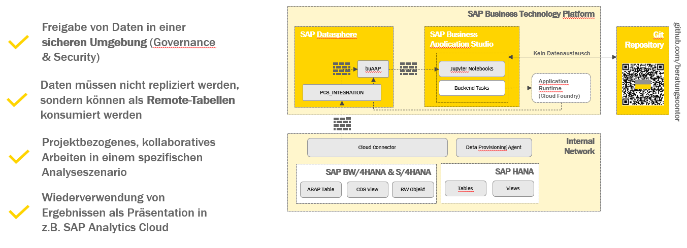

# Advanced Sales Analytics
Diese Demo wurde im Zuge des 1. beratungscontor Data & Analytics Summit vorbereitet und präsentiert.

Demo einer Advanced Sales Analytics mit SAP Datasphere und SAP Business Application Studio in der SAP Business Technology Platform (Cloud Foundry) unter Verwendung dieses Github Repository.



Es soll eine Sales Analyse auf Verkaufsdaten ausgeführt werden. Dabei ist es das Ziel, Muster, Zusammenhänge, Auswirkungen und Trends innerhalb des Umsatzes zu identifizieren und zu belegen bzw. zu wiederlegen.

Die Ergebnisse einer Analyse können in einen Ordner als Analyseprojekt zusammengefasst werden. Die Ergebnisse sollten transparent und offen sein, so dass andere Teams nicht davon profitieren können, sich austauschen können und vor allem nicht doppelt oder mehrfach die gleichen grundlegenden Analysen durchführen müssen.

Grundlage für die Demo sind die synthetischen Kundendaten PCS dFashion, welche klassische Merkmale und Kennzahlen enthalten zur Auswertung des Umsatzes. Dabei werden ausschließlich Technologien der SAP Business Technology Platform verwendet.

* SAP Datasphere für das Speichern und Berechnen von Daten auf einer Datenbank (SAP HANA Cloud) innerhalb eines Spaces
* SAP Business Application Studio für das Sammeln, Auswerten und Analysieren von Daten als Python-Skripte oder Jupyter Notebooks

Insgesamt werden über ein Cloud Foundry Space drei Szenarien abgebildet:
* (tbd) Python SAP Datasphere CF-Task  - Einplanbarer Task, welcher Daten aus einer beliebigen Quelle (z.B. Wetterdateb des Deutschen Wetterdienstes) nach SAP Datasphere lädt.
* (tbd) Python Data Streamlit Application - Standard Dashboard mit Daten aus einer SAP HANA Cloud und/oder BW Query; mit einer Möglichkeit der Dateneingabe.
* Jupyter Notebooks Analytics - Standardanalysen und Einflussfaktoren auf den Sales

## 🏃 Vorgehensweise
- [X] Anlegen eines Github Repositories beratungcontor/advanced-sales-analytics
- [X] Vorbereiten eine Development Spaces im SAP Business Application Studio mit dem Github Repository, sowie Environment Variables für den Zugriff auf SAP Datasphere
- [X] PCS dFashion Daten über den Space PCS_INTEGRATION laden und in den Space buAAP freigeben (BW/4HANA -> SAP HANA Cloud (SDA) -> Remote Tabelle -> View)
- [X] Analyse 1: Statistisches Profil der PCS dFashion (Tabelle = stat. Dataset?); ggf. Ableitung eines Datasets für weitere Analysen (ipynb-analytics)
- [ ] Analyse 2: Je nach Ergebnise aus Analyse 1 eine erweiterte Analyse durchführen.
- [ ] (tbd) Python-Skript als Cloud Foundry Backend Service zum Laden von Wetterdaten in den SAP Datasphere Space (py-dsp-task)
- [ ] Wetterdaten (DE) Daten in den Space buAAP laden (Externe Daten (SAP HANA) -> Datenfluss -> Tabelle)
- [ ] Verknüpfen der PCS dFashion Wetterdaten
- [ ] Analyse 3: Durchführung eines AutoML (Gradient Boosted Decision Tree (Regression)) auf Umsatz zur Identifikation von Einflussfaktoren; Ausgabe als Bericht

## 🧑‍💻 SAP Business Application Studio
SAP Business Application Studio ist technisch eine angepasste Version von [code-server](https://github.com/coder/code-server) und basiert technisch auf VSCode von Microsoft. Mit der Umstellung von [Eclipse Theia](https://theia-ide.org/) in Q4.2022 ergeben sich einige technische Vorteile in der Anwendung.
* Offenes VSCode Extension Ökosystem, ergänzt um öffentliche und nicht-öffentliche SAP Extensions 
* Python 3.9.2 (Q2.2023) vorinstalliert 

### Vorbereitung SAP Business Application Studio
---
**HINWEIS**

In der neusten Version ist bereits PyPi installiert, so dass die Installation nicht mehr notwendig ist. Für ältere Tenanst müssen noch die folgenden Schritte ausgeführt werden, um Python Package Index (PyPI) im Terminal nutzen zu können.

Um zu überprüfen, ob PyPI bereit installiert ist, ist das Öffnen des Terminal und der Eingabe des folgenden Befehls ausreichend.
```shell
pip --version
```

Sofern eine Version angezeigt wird, ist PyPI bereits installiert und der nächste Schritt kann übersprungen werden.

---
#### Optional, sofern nicht installiert: Installation Python Package Index (PyPI)
Öffne ein neues Terminal and installiere PyPI mit dem folgenden Befehl. 
```shell
cd ~ && curl https://bootstrap.pypa.io/get-pip.py > get-pip.py && python3 get-pip.py && echo "export PATH=/home/user/.local/bin:$PATH" >> .bashrc && source ~/.bashrc
```

#### Github Repository klonen und öffnen
Über die Startseite (bei geschlossenen Projekt) kann im Business Application Studio direkt ein Git Repository eingebunden werden. Als Projektordner wählt man entsprechend das /home/user/projects Verzeichnis aus. Anschließend wird der Inhalt aus dem Github Repository in ein neues Verzeichnis /home/user/projects/advanced-sales-analytics geklont und geöffnet.

#### Installation Requirements
Öffne ein neues Terminal und installiere die notwendigen Python Bibliotheken mit dem folgenden Befehl.
```shell
pip install -r requirements.txt
```

#### Einbindung Environment Variable (.env)
Erstelle eine lokale Umgebungsvariable/Environment Variable unter /home/users/projects/advanced-sales-analytics/.env, welche die Verbindungsinformationen zum SAP HANA Cloud Datasphere Space (OpenSQL) enthält. Diese Variable wird über die Datei .gitignore nicht berücksichtigt und ist daher nicht Bestandteil des Git Repositories.
*Die Verbindungsinformationen können eingesehen werden unter SAP Datasphere > Spaces > buAAP > Datenbankzugriff > Datenbankbenutzer*
```json
{
    "host":"",
    "port":443,
    "user":"",
    "password":"",
    "schema":""
}
```

#### 🔴 Fehler: Es kann keine Verbindung zum SAP Datasphere Space hergestellt werden (Connection failed (RTE:[89013] Socket closed by peer)
Für die Verwendung des Business Application Studio gegen SAP Datasphere muss dieses in der Firewall mit einer IP freigegeben werden.
Unter System > Konfiguration > IP-Erlaubtliste > Vertrauenswürdige IPs kann die IP-Adresse des Business Application Studios hinzugefügt werden. 

Die IP-Adresse ist abhängig von der Region des Business Application Studios und kann unter [SAP Help](https://help.sap.com/docs/bas/sap-business-application-studio/sap-business-application-studio-availability) eingesehen werden.

Nicht vergessen in SAP Datasphere die Liste zu sichern und anschließend bis zu 5 Minuten abzuwarten.

### Deployment Options
#### No route mapping, no staging and no starting
```shell
cf push --no-route --no-start
```

